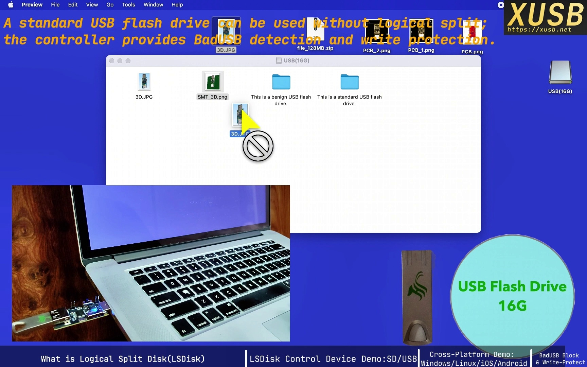

# XUSB
>Built for Universal Compatibility — X = Explore the Potential of Universal Devices

This repository hosts the XUSB website at https://xusb.net. The site presents our work across three focus areas:

## [1.Smart Storage](https://xusb.net/project-1/)
The flagship work is Logical Split Disk (LSDisk), a hardware-level approach to reclaiming control over storage devices and virtualizing a single medium into multiple isolated disks without host-side drivers.

Logical Split Disk article:
[I built a USB controller that reclaims control of the storage device and turns one flash drive into four.](https://xusb.net/project-1/logical-split-disk-embodiment/)

## 2.Smart Access
To be updated.

## 3.Flow Control 
To be updated.

---

This website is informational only. For the full legal notice, see [About page Legal Notice](http://127.0.0.1:4000/about/).

